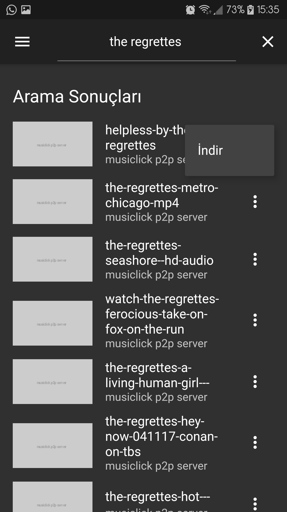

# Musiclick

YouTube mp3 download app. App language is currently Turkish.

## Installation
To use your own server check this repo [ytmp3-node](https://github.com/akinozgen/ytmp3-node)

Then edit the server line at [lib/pages/home_page.dart:27](https://github.com/akinozgen/ytmp3-android/blob/c78505a124cac6300472f4e562a34383b658f0a9/lib/pages/home_page.dart#L27)

To run;
`flutter run android # or ios`

To build;
`flutter build apk # or whatever for ios is...`

### Screenshots
<table width="100%">
    <tr>
        <td></td>
        <td></td>
        <td></td>
        <td></td>
        <td></td>
        <td></td>
    </tr>
</table>
